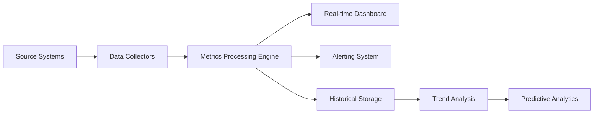

# DIRK QUALITY METRICS SYSTEM
**Case ID**: CASE-CRAWLZILLA-008  
**DIRK Tag**: #DIRK-MACOS-CPP-CRAWLZILLA-20250111-0004  
**Status**: ACTIVE  
**Priority**: HIGH  

## 📊 ENTERPRISE QUALITY MEASUREMENT FRAMEWORK

### SYSTEMATIC DOUBT (P1) - METRICS VALIDATION
- **Measurement Accuracy**: All metrics must be empirically validated
- **Bias Detection**: Continuous monitoring for measurement bias
- **Baseline Verification**: Historical baselines regularly re-validated
- **Trend Analysis**: Statistical significance required for trend claims

### FOUNDATIONAL REASONING (P2) - METRICS ARCHITECTURE
- **SMART Metrics**: Specific, Measurable, Achievable, Relevant, Time-bound
- **Leading vs Lagging**: Balance of predictive and outcome metrics
- **Actionable Insights**: Every metric must drive specific actions
- **Stakeholder Alignment**: Metrics serve specific business objectives

## 🎯 CORE QUALITY METRICS CATEGORIES

### 🔒 SECURITY METRICS
```yaml
security_metrics:
  vulnerability_density:
    name: "Security Vulnerability Density"
    formula: "Critical Vulnerabilities / KLOC"
    target: "< 0.1 per KLOC"
    measurement_frequency: "Daily"
    data_source: "SAST/DAST scans"
    
  security_coverage:
    name: "Security Test Coverage"
    formula: "(Security Tests Passed / Total Security Tests) * 100"
    target: "> 98%"
    measurement_frequency: "Per build"
    data_source: "Security test suite"
    
  incident_response_time:
    name: "Security Incident MTTR"
    formula: "Total Response Time / Number of Incidents"
    target: "< 4 hours"
    measurement_frequency: "Per incident"
    data_source: "Incident management system"
```

### ⚡ PERFORMANCE METRICS
```yaml
performance_metrics:
  response_time_p95:
    name: "95th Percentile Response Time"
    formula: "P95(Response Times)"
    target: "< 100ms"
    measurement_frequency: "Real-time"
    data_source: "APM monitoring"
    
  throughput:
    name: "Request Throughput"
    formula: "Requests Processed / Time Period"
    target: "> 10,000 RPS"
    measurement_frequency: "Real-time"
    data_source: "Load balancer metrics"
    
  resource_efficiency:
    name: "Resource Utilization Efficiency"
    formula: "(Useful Work / Total Resources) * 100"
    target: "> 85%"
    measurement_frequency: "Hourly"
    data_source: "System monitoring"
```

### 🧪 CODE QUALITY METRICS
```yaml
code_quality_metrics:
  test_coverage:
    name: "Unit Test Coverage"
    formula: "(Lines Covered / Total Lines) * 100"
    target: "> 95%"
    measurement_frequency: "Per commit"
    data_source: "Coverage tools"
    
  cyclomatic_complexity:
    name: "Average Cyclomatic Complexity"
    formula: "Sum(CC per function) / Number of functions"
    target: "< 10"
    measurement_frequency: "Per commit"
    data_source: "Static analysis"
    
  technical_debt_ratio:
    name: "Technical Debt Ratio"
    formula: "(Remediation Time / Development Time) * 100"
    target: "< 5%"
    measurement_frequency: "Weekly"
    data_source: "SonarQube analysis"
```

### 🔄 PROCESS METRICS
```yaml
process_metrics:
  build_success_rate:
    name: "Build Success Rate"
    formula: "(Successful Builds / Total Builds) * 100"
    target: "> 98%"
    measurement_frequency: "Per build"
    data_source: "CI/CD pipeline"
    
  deployment_frequency:
    name: "Deployment Frequency"
    formula: "Number of Deployments / Time Period"
    target: "> 5 per week"
    measurement_frequency: "Weekly"
    data_source: "Deployment logs"
    
  mean_time_to_recovery:
    name: "Mean Time To Recovery (MTTR)"
    formula: "Total Downtime / Number of Incidents"
    target: "< 30 minutes"
    measurement_frequency: "Per incident"
    data_source: "Incident tracking"
```

## 📈 QUALITY SCORE CALCULATION

### Weighted Quality Score Algorithm
```typescript
interface QualityMetric {
  name: string;
  current_value: number;
  target_value: number;
  weight: number;
  category: 'security' | 'performance' | 'quality' | 'process';
  trend: 'improving' | 'stable' | 'declining';
}

function calculateQualityScore(metrics: QualityMetric[]): number {
  let totalWeightedScore = 0;
  let totalWeight = 0;
  
  for (const metric of metrics) {
    const achievementRatio = Math.min(metric.current_value / metric.target_value, 1.0);
    const weightedScore = achievementRatio * metric.weight;
    
    totalWeightedScore += weightedScore;
    totalWeight += metric.weight;
  }
  
  return (totalWeightedScore / totalWeight) * 100;
}
```

### Quality Grade Classification
```
A+ (95-100%): Exceptional quality, industry leading
A  (90-94%):  Excellent quality, meets all targets  
B+ (85-89%):  Good quality, minor improvements needed
B  (80-84%):  Acceptable quality, some concerns
C+ (75-79%):  Below expectations, action required
C  (70-74%):  Poor quality, immediate intervention
F  (<70%):    Unacceptable, stop-work conditions
```

## 🔍 REAL-TIME MONITORING SYSTEM

### Data Collection Pipeline


### Monitoring Infrastructure
- **Prometheus**: Metrics collection and storage
- **Grafana**: Real-time visualization dashboards
- **AlertManager**: Intelligent alerting system
- **ElasticSearch**: Historical data analysis
- **Kibana**: Advanced analytics and reporting

## 🚨 ALERT THRESHOLDS & ESCALATION

### Alert Severity Levels
```yaml
alert_thresholds:
  critical:
    quality_score: "< 70%"
    security_incidents: "> 0"
    performance_degradation: "> 50%"
    escalation_time: "Immediate"
    
  warning:
    quality_score: "< 85%"
    test_coverage: "< 90%"
    build_failures: "> 5%"
    escalation_time: "15 minutes"
    
  info:
    quality_score: "< 95%"
    deployment_delays: "> 30 minutes"
    escalation_time: "1 hour"
```

### Escalation Matrix
1. **Developer Alert**: Immediate notification to code owner
2. **Team Lead**: 15 minutes for warnings, immediate for critical
3. **Engineering Manager**: 1 hour for warnings, 15 minutes for critical
4. **VP Engineering**: 4 hours for warnings, 1 hour for critical
5. **Executive Team**: Critical issues only, immediate escalation

## 📊 QUALITY REPORTING DASHBOARD

### Executive Summary View
- Overall quality score with trend
- Key metrics performance against targets
- Critical issue summary
- Quality improvement recommendations
- Compliance status overview

### Developer Detail View
- Individual metric deep-dives
- Code quality heatmaps
- Performance bottleneck analysis
- Test coverage gaps
- Technical debt breakdown

### Historical Analysis
- Quality trend analysis over time
- Correlation analysis between metrics
- Predictive quality modeling
- Benchmarking against industry standards
- ROI analysis of quality improvements

## 🔧 METRICS AUTOMATION & TOOLING

### Automated Data Collection
```bash
# Performance Metrics Collection
curl -X POST http://metrics-api/performance \
  -d "response_time=$RESPONSE_TIME&throughput=$THROUGHPUT"

# Code Quality Metrics
sonar-scanner -Dsonar.projectKey=crawlzilla \
  -Dsonar.qualitygate.wait=true

# Security Metrics
./security_scan.sh --output-metrics /tmp/security_metrics.json
```

### Custom Metrics Plugins
- **DIRK Quality Plugin**: Custom quality score calculation
- **Performance Tracker**: Real-time performance monitoring
- **Security Scanner**: Continuous security assessment
- **Compliance Checker**: Automated compliance validation

## 📚 METRICS GOVERNANCE

### Data Quality Standards
- **Accuracy**: ±2% measurement error tolerance
- **Completeness**: >99% data capture rate
- **Timeliness**: Real-time for critical, hourly for others
- **Consistency**: Standardized calculation methods
- **Auditability**: Full traceability of all measurements

### Change Management
- Metric definition changes require approval
- Historical data preservation during changes
- Impact analysis before metric retirement
- Stakeholder notification for significant changes

---

**Last Updated**: 2025-01-11  
**Next Review**: 2025-01-12  
**Metrics Owner**: DIRK Framework  
**Dashboard URL**: http://localhost:8080/quality-dashboard
