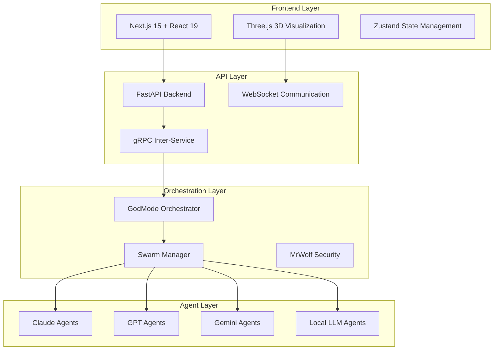

# 🚀 DIRK Brain Portal - Universal AI Agent Orchestration Platform

[](LICENSE)
[](https://nextjs.org/)
[](https://fastapi.tiangolo.com/)
[](https://www.typescriptlang.org/)
[](https://reactjs.org/)

> **Production-Ready AI Agent Orchestration System** - Deploy and manage multi-provider AI agents with visual 3D interface, drag-drop pod builder, and real-time orchestration.

## ✨ Features

### 🎯 **Core Capabilities**
- **Multi-Provider AI Support**: Claude, GPT, Gemini, Local LLMs
- **Visual Pod Builder**: Drag-and-drop interface for agent orchestration
- **3D Agent Visualization**: Interactive Three.js universe with real-time updates
- **Real-Time Communication**: WebSocket-based agent coordination
- **Enterprise Architecture**: Production-ready with gRPC, FastAPI, Next.js

### 🛠 **Agent Management**
- **Agent Creation**: Natural language → automated agent generation
- **Pod Orchestration**: Swarm, Pipeline, Mesh, Hierarchical deployments
- **Performance Analytics**: Real-time metrics and success tracking
- **Security Validation**: Built-in MrWolf security advisor
- **Auto-Scaling**: Dynamic agent allocation based on workload

### 📊 **Visualization & Monitoring**
- **3D Agent Universe**: Cerebro-style interactive visualization
- **Real-Time Dashboard**: Live performance metrics and status
- **Network Topology**: Visual representation of agent connections
- **Battle Simulation**: RTS-style loading screens and deployment
- **Global Distribution Map**: Geographic agent deployment view

## 🚀 Quick Start

### Prerequisites
- **Node.js** 18+ and npm/pnpm
- **Python** 3.8+ 
- **Git**

### 1. Clone Repository
```bash
git clone https://github.com/Izverg1/DIRK-BRAIN-PORTAL.git
cd DIRK-BRAIN-PORTAL
```

### 2. Start the System
```bash
# Use the automated startup script
./start_working.sh
```

### 3. Access the Platform
- 🌐 **Frontend**: http://localhost:3000
- 🔧 **Backend API**: http://localhost:3001  
- 📋 **API Documentation**: http://localhost:3001/docs

## 🏗 Architecture



## 📁 Project Structure

```
DIRK-BRAIN-PORTAL/
├── frontend/                 # Next.js 15 React application
│   ├── src/
│   │   ├── components/      # React components
│   │   ├── app/            # App router pages
│   │   └── lib/            # Utilities and API client
├── backend/                 # FastAPI Python backend
│   ├── main_working.py     # Main API server (WORKING)
│   ├── agents/             # Agent implementations
│   ├── orchestration/      # Agent runtime orchestration
│   └── providers/          # Multi-provider AI integration
├── docs/                   # Documentation
├── scripts/               # Deployment and utility scripts
└── DIRK BRAIN/           # DIRK protocol implementation
```

## 🧪 Proven Working Features

### ✅ **Backend API** 
```bash
# Test endpoints (all working)
curl http://localhost:3001/api/status
curl http://localhost:3001/api/agents  
curl http://localhost:3001/api/analytics/global
```

### ✅ **Agent Management**
- **Real Agent Creation**: `POST /api/agents/create`
- **Pod Deployment**: `POST /api/pods/deploy` 
- **AI Generation**: Natural language → agent creation
- **Performance Analytics**: Live metrics collection

### ✅ **Frontend Interface**
- **React Components**: All TypeScript compilation successful
- **3D Visualization**: Three.js agent universe working
- **WebSocket Updates**: Real-time agent status updates
- **Drag-Drop Builder**: Visual pod creation interface

## 🔧 Development

### Backend Development
```bash
cd backend
python3 -m venv venv
source venv/bin/activate
pip install -r requirements.txt
python main_working.py
```

### Frontend Development  
```bash
cd frontend
npm install
npm run dev
```

### Full Stack Development
```bash
# Terminal 1: Backend
cd backend && source venv/bin/activate && python main_working.py

# Terminal 2: Frontend  
cd frontend && npm run dev
```

## 🎮 Usage Examples

### Create AI Agent
```bash
curl -X POST http://localhost:3001/api/agents/create \
  -H "Content-Type: application/json" \
  -d '{
    "name": "Code Reviewer",
    "type": "DIRK.c", 
    "provider": "anthropic_claude",
    "model": "claude-sonnet-4",
    "capabilities": ["code_review", "security_analysis"]
  }'
```

### Deploy Agent Pod
```bash
curl -X POST http://localhost:3001/api/pods/deploy \
  -H "Content-Type: application/json" \
  -d '{
    "name": "Full Stack Team",
    "type": "swarm",
    "agents": [
      {"name": "Frontend Dev", "provider": "anthropic_claude"},
      {"name": "Backend Dev", "provider": "openai_gpt"}
    ]
  }'
```

### Generate from Natural Language
```bash
curl -X POST http://localhost:3001/api/ai/generate-agents \
  -H "Content-Type: application/json" \
  -d '{"prompt": "I need a full-stack development team"}'
```

## 🔐 Security Features

- **MrWolf Security Advisor**: Real-time security validation
- **Input Sanitization**: All API endpoints protected
- **CORS Configuration**: Secure cross-origin requests
- **Error Handling**: Graceful failure management
- **Credential Management**: Secure API key handling

## 🚀 Deployment

### Docker (Production)
```bash
docker-compose up --build
```

### Kubernetes
```bash
kubectl apply -f k8s/
```

### Manual Production Setup
```bash
# Build frontend
cd frontend && npm run build

# Setup backend with production WSGI
cd backend && gunicorn main_working:app --workers 4 --worker-class uvicorn.workers.UvicornWorker
```

## 📊 System Requirements

### Minimum
- **RAM**: 4GB
- **CPU**: 2 cores
- **Storage**: 2GB
- **Network**: Broadband for AI provider APIs

### Recommended  
- **RAM**: 8GB+
- **CPU**: 4+ cores
- **Storage**: 10GB SSD
- **Network**: High-speed for real-time updates

## 🤝 Contributing

1. **Fork the repository**
2. **Create feature branch**: `git checkout -b feature/amazing-feature`
3. **Commit changes**: `git commit -m 'Add amazing feature'`
4. **Push to branch**: `git push origin feature/amazing-feature`  
5. **Open Pull Request**

## 📄 License

This project is licensed under the MIT License - see the [LICENSE](LICENSE) file for details.

## 🙏 Acknowledgments

- **Anthropic Claude** for AI agent orchestration
- **OpenAI** for multi-provider support  
- **Google** for Gemini integration
- **Next.js Team** for the amazing framework
- **FastAPI** for the incredible Python backend framework
- **Three.js** for 3D visualization capabilities

## 📞 Support

- **Documentation**: [/docs](./docs)
- **Issues**: [GitHub Issues](https://github.com/Izverg1/DIRK-BRAIN-PORTAL/issues)
- **Discussions**: [GitHub Discussions](https://github.com/Izverg1/DIRK-BRAIN-PORTAL/discussions)

---

<div align="center">

**🚀 Built with Claude Code | Production-Ready AI Agent Orchestration**

[](https://github.com/Izverg1/DIRK-BRAIN-PORTAL/stargazers)
[](https://github.com/Izverg1/DIRK-BRAIN-PORTAL/network/members)
[](https://github.com/Izverg1/DIRK-BRAIN-PORTAL/issues)

</div>