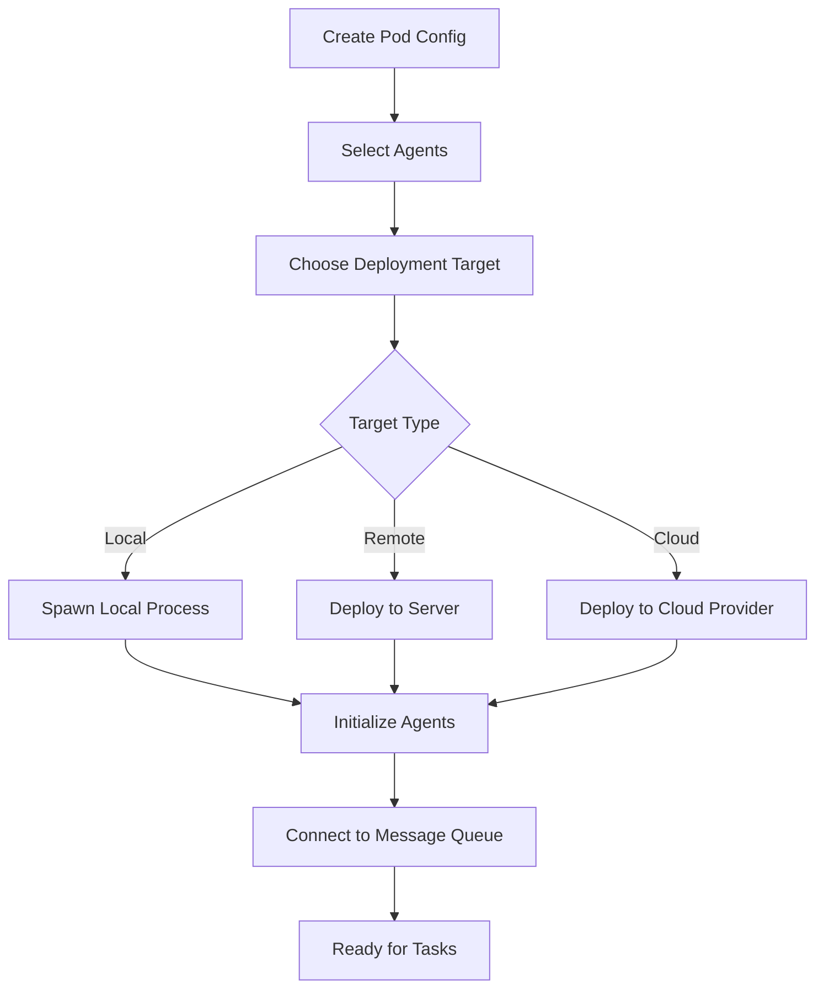

# Multi-Platform Agent Architecture
## DIRK Brain Portal - Universal AI Agent Orchestration Platform

### Executive Summary
The DIRK Brain Portal serves as a universal orchestration platform for deploying and managing AI agents from multiple providers (Anthropic Claude, Google Gemini, OpenAI GPT, local models) across different environments (local, remote, cloud).

---

## 1. Agent Types & Providers

### 1.1 Primary Agent Providers
```yaml
providers:
  anthropic:
    models:
      - claude-opus-4.1      # Best for complex reasoning
      - claude-sonnet-4      # Balanced performance
      - claude-haiku-3.5     # Fast, efficient
    capabilities:
      - code_generation
      - analysis
      - planning
      - collaboration
    
  google:
    models:
      - gemini-1.5-pro       # Multi-modal capabilities
      - gemini-1.5-flash     # Fast responses
    capabilities:
      - verification
      - multi_modal_analysis
      - data_processing
    
  openai:
    models:
      - gpt-4-turbo
      - gpt-4o
    capabilities:
      - general_purpose
      - function_calling
      - code_interpretation
    
  local:
    models:
      - llama-3
      - mistral
      - codellama
    capabilities:
      - privacy_focused
      - offline_operation
      - custom_training
```

### 1.2 Agent Pod Types
```typescript
interface AgentPod {
  id: string;
  name: string;
  type: 'swarm' | 'pipeline' | 'mesh' | 'hierarchical';
  agents: Agent[];
  deployment: 'local' | 'remote' | 'cloud' | 'hybrid';
  project?: string;
  configuration: PodConfiguration;
}

enum PodType {
  SWARM = "swarm",           // Parallel processing, voting consensus
  PIPELINE = "pipeline",     // Sequential processing, chain of thought
  MESH = "mesh",            // Interconnected, peer-to-peer
  HIERARCHICAL = "hierarchical" // Manager-worker pattern
}
```

---

## 2. Agent Pod Architecture

### 2.1 Swarm Configuration
```javascript
{
  "pod_type": "swarm",
  "agents": [
    {
      "provider": "anthropic",
      "model": "claude-opus-4.1",
      "role": "primary_coder",
      "capabilities": ["code_generation", "architecture"]
    },
    {
      "provider": "google",
      "model": "gemini-1.5-pro",
      "role": "verifier",
      "capabilities": ["code_review", "security_check"]
    },
    {
      "provider": "anthropic",
      "model": "claude-sonnet-4",
      "role": "documenter",
      "capabilities": ["documentation", "testing"]
    }
  ],
  "consensus": "majority_vote",
  "parallel_execution": true
}
```

### 2.2 Pipeline Configuration
```javascript
{
  "pod_type": "pipeline",
  "stages": [
    {
      "stage": 1,
      "agent": "claude-opus-4.1",
      "task": "requirement_analysis"
    },
    {
      "stage": 2,
      "agent": "claude-sonnet-4",
      "task": "implementation"
    },
    {
      "stage": 3,
      "agent": "gemini-1.5-pro",
      "task": "verification",
      "hooks": {
        "pre": "security_scan",
        "post": "deployment_check"
      }
    }
  ]
}
```

---

## 3. Integration Architecture

### 3.1 Provider Integration Layer
```python
class UniversalAgentInterface:
    """Unified interface for all agent providers"""
    
    def __init__(self):
        self.providers = {
            'anthropic': AnthropicProvider(),
            'google': GeminiProvider(),
            'openai': OpenAIProvider(),
            'local': LocalModelProvider()
        }
    
    async def create_agent(self, config: AgentConfig) -> Agent:
        provider = self.providers[config.provider]
        return await provider.spawn_agent(config)
    
    async def execute_task(self, agent: Agent, task: Task) -> Result:
        return await agent.execute(task)
```

### 3.2 Hook System for Cross-Platform Verification
```typescript
interface HookSystem {
  preExecution: Hook[];
  postExecution: Hook[];
  verification: Hook[];
}

class VerificationHook implements Hook {
  async execute(result: any) {
    // Primary execution with Claude
    const primaryResult = result;
    
    // Double-check with Gemini
    const verificationResult = await geminiAPI.verify({
      task: result.task,
      output: result.output,
      criteria: result.verificationCriteria
    });
    
    return {
      primary: primaryResult,
      verified: verificationResult.approved,
      confidence: verificationResult.confidence
    };
  }
}
```

### 3.3 Slash Commands for Agent Control
```typescript
const slashCommands = {
  '/deploy': async (args) => {
    // Deploy agent pod
    const pod = await createAgentPod(args.config);
    return await deployPod(pod, args.target);
  },
  
  '/verify': async (args) => {
    // Trigger Gemini verification
    return await geminiVerify(args.task, args.output);
  },
  
  '/swarm': async (args) => {
    // Create agent swarm
    return await createSwarm(args.agents, args.consensus);
  },
  
  '/pipeline': async (args) => {
    // Create processing pipeline
    return await createPipeline(args.stages);
  }
};
```

---

## 4. Deployment Architecture

### 4.1 Deployment Targets
```yaml
deployment_targets:
  local:
    type: "process"
    resources:
      cpu: "2 cores"
      memory: "4GB"
    providers:
      - anthropic_api
      - local_models
  
  remote:
    type: "server"
    protocol: "grpc"
    authentication: "api_key"
    providers:
      - all
  
  cloud:
    aws:
      service: "lambda"
      region: "us-east-1"
    gcp:
      service: "cloud_run"
      region: "us-central1"
    azure:
      service: "functions"
      region: "eastus"
```

### 4.2 Agent Pod Deployment Flow


---

## 5. Visual Pod Creation UI Components

### 5.1 Pod Builder Interface
```typescript
interface PodBuilderUI {
  // Visual drag-and-drop agent selection
  agentPalette: AgentProvider[];
  
  // Canvas for pod design
  podCanvas: {
    addAgent: (agent: Agent) => void;
    connectAgents: (from: Agent, to: Agent) => void;
    setPodType: (type: PodType) => void;
    configureConsensus: (method: ConsensusMethod) => void;
  };
  
  // Deployment configuration
  deploymentConfig: {
    target: DeploymentTarget;
    resources: ResourceAllocation;
    scaling: ScalingPolicy;
  };
}
```

### 5.2 Real-time Pod Visualization
```typescript
interface PodVisualization {
  // 3D representation of agent pod
  render3DPod: (pod: AgentPod) => Three.Scene;
  
  // Show agent connections and data flow
  showDataFlow: (pod: AgentPod) => DataFlowDiagram;
  
  // Real-time metrics
  displayMetrics: {
    taskThroughput: number;
    averageLatency: number;
    errorRate: number;
    agentUtilization: Map<string, number>;
  };
}
```

---

## 6. Implementation Plan

### Phase 1: Core Infrastructure (Week 1-2)
- [ ] Universal Agent Interface
- [ ] Provider integration (Anthropic, Google, OpenAI)
- [ ] Basic pod creation API
- [ ] Local deployment capability

### Phase 2: Visual Pod Builder (Week 3-4)
- [ ] Drag-and-drop UI for pod creation
- [ ] Agent connection visualization
- [ ] Pod configuration interface
- [ ] 3D pod visualization

### Phase 3: Advanced Deployment (Week 5-6)
- [ ] Remote server deployment
- [ ] Cloud provider integration (AWS, GCP, Azure)
- [ ] Auto-scaling implementation
- [ ] Load balancing for pods

### Phase 4: Verification & Hooks (Week 7-8)
- [ ] Hook system implementation
- [ ] Gemini verification integration
- [ ] Slash command system
- [ ] Cross-platform consensus mechanisms

### Phase 5: Project Integration (Week 9-10)
- [ ] Project assignment system
- [ ] Multi-project pod management
- [ ] Resource allocation per project
- [ ] Inter-pod communication

---

## 7. API Specifications

### 7.1 Pod Creation API
```typescript
POST /api/pods/create
{
  "name": "FullStackDevelopmentPod",
  "type": "swarm",
  "agents": [
    {
      "provider": "anthropic",
      "model": "claude-opus-4.1",
      "role": "architect"
    },
    {
      "provider": "anthropic",
      "model": "claude-sonnet-4",
      "role": "developer"
    },
    {
      "provider": "google",
      "model": "gemini-1.5-pro",
      "role": "reviewer"
    }
  ],
  "deployment": "local",
  "project": "NOT_TODAY",
  "consensus": "weighted_vote",
  "resources": {
    "maxConcurrentTasks": 5,
    "memoryLimit": "8GB",
    "timeout": 300
  }
}
```

### 7.2 Task Assignment API
```typescript
POST /api/pods/{podId}/execute
{
  "task": {
    "description": "Build a REST API for user management",
    "requirements": [
      "Authentication with JWT",
      "CRUD operations",
      "Input validation"
    ],
    "verificationCriteria": {
      "mustPass": ["security_scan", "unit_tests"],
      "minimumCoverage": 80
    }
  },
  "hooks": {
    "pre": ["dependency_check"],
    "post": ["gemini_verify", "deploy_to_staging"]
  }
}
```

---

## 8. Security & Compliance

### 8.1 API Key Management
```python
class SecureCredentialVault:
    def __init__(self):
        self.vault = {
            'anthropic': encrypted_storage.get('ANTHROPIC_API_KEY'),
            'google': encrypted_storage.get('GOOGLE_API_KEY'),
            'openai': encrypted_storage.get('OPENAI_API_KEY')
        }
    
    def get_credential(self, provider: str) -> str:
        return self.vault.get(provider)
```

### 8.2 Audit Logging
```typescript
interface AuditLog {
  timestamp: Date;
  podId: string;
  agentId: string;
  action: string;
  input: any;
  output: any;
  verificationStatus?: 'passed' | 'failed';
  provider: string;
  model: string;
}
```

---

## 9. Example Use Cases

### 9.1 Full-Stack Development Pod
```javascript
const fullStackPod = {
  name: "FullStackDevTeam",
  type: "pipeline",
  agents: [
    { provider: "anthropic", model: "claude-opus-4.1", role: "backend_dev" },
    { provider: "anthropic", model: "claude-sonnet-4", role: "frontend_dev" },
    { provider: "google", model: "gemini-1.5-pro", role: "qa_tester" }
  ],
  workflow: [
    "requirement_analysis",
    "api_development",
    "frontend_implementation",
    "integration_testing",
    "deployment"
  ]
};
```

### 9.2 Security Analysis Swarm
```javascript
const securitySwarm = {
  name: "SecurityAuditTeam",
  type: "swarm",
  agents: [
    { provider: "anthropic", model: "claude-opus-4.1", role: "code_auditor" },
    { provider: "google", model: "gemini-1.5-pro", role: "vulnerability_scanner" },
    { provider: "openai", model: "gpt-4-turbo", role: "penetration_tester" }
  ],
  consensus: "unanimous",
  parallel: true
};
```

---

## 10. Monitoring & Observability

### 10.1 Pod Metrics
```typescript
interface PodMetrics {
  podId: string;
  uptime: number;
  tasksCompleted: number;
  averageResponseTime: number;
  errorRate: number;
  costPerTask: number;
  agentMetrics: Map<string, AgentMetrics>;
}

interface AgentMetrics {
  agentId: string;
  provider: string;
  tokensUsed: number;
  apiCalls: number;
  averageLatency: number;
  successRate: number;
}
```

---

## Conclusion

This architecture enables the DIRK Brain Portal to serve as a universal orchestration platform for AI agents from multiple providers, with flexible deployment options and sophisticated pod configurations. The system supports various collaboration patterns (swarm, pipeline, mesh, hierarchical) and provides visual tools for creating and managing agent pods across different projects and environments.